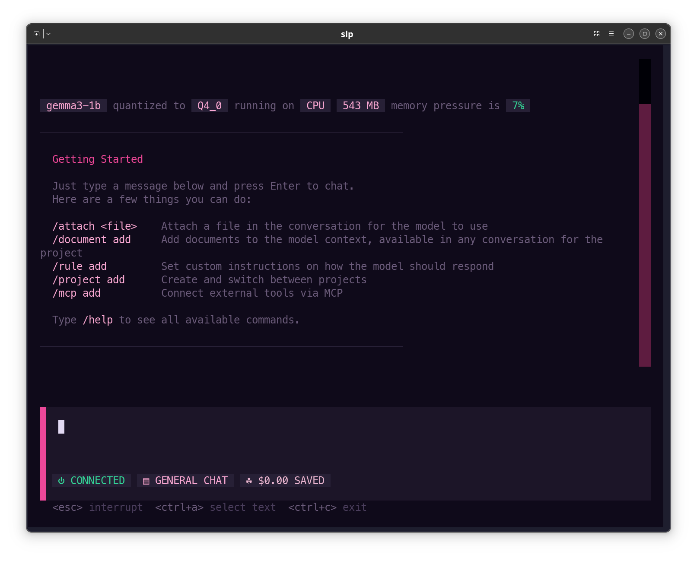

<p align="center">
  <a href="https://smartloop.ai">
    <picture>
      <source media="(prefers-color-scheme: dark)" srcset="https://github.com/user-attachments/assets/9ced8d4f-3c5d-46e5-a1e8-0b7e9e70e4d9" />
      <source media="(prefers-color-scheme: light)" srcset="https://github.com/user-attachments/assets/c08ace32-92f9-4d50-849e-ee68c4ac1a48" />
      
    </picture>
  </a>
</p>
<p align="center">A small language model framework for local inference and fine-tuning.</p>
<p align="center">
  <a href="https://github.com/smartloop-ai/smartloop/blob/main/LICENSE"></a>
</p>

[](https://smartloop.ai)

---

### Installation

```bash
# Quick install
curl -fsSL https://smartloop.ai/install | bash

# Homebrew
brew tap smartloop-ai/smartloop
brew install smartloop
```

> [!TIP]
> To upgrade via Homebrew: `brew update && brew upgrade smartloop`

### Uninstall

```bash
# If installed via curl
curl -fsSL https://smartloop.ai/uninstall | bash

# If installed via Homebrew
brew uninstall smartloop
brew untap smartloop-ai/smartloop
```

### Usage

```bash
# View available commands
slp --help

# Initialize a new project
slp init -t <developer_token>

# Add a document for training
slp add document.pdf

# Run interactive chat
slp run

# no tui 
slp run --no-tui
```


### Project Management

```bash
slp projects create <name>
slp projects list
slp projects switch <name>
slp status
```

### Server Management

SLP includes a background API server compatible with OpenAI's chat completion format.

```bash
slp server start
slp server stop
slp server status
```

On macOS, the server can also be managed via `brew services` (if installed using Homebrew):

```bash
brew services start smartloop
brew services stop smartloop
```

On Linux/WSL, the installer creates a systemd user service:

```bash
systemctl --user start smartloop
systemctl --user stop smartloop
systemctl --user status smartloop
```

### Supported Models

| Model | Base Model | Size |
| ----- | ---------- | ---- |
| `gemma3-1b` | google/gemma-3-1b-it | 1B |
| `gemma3-4b` | google/gemma-3-4b-it | 4B |
| `llama3-1b` | meta-llama/Llama-3.2-1B-Instruct | 1B |
| `llama3-3b` | meta-llama/Llama-3.2-3B-Instruct | 3B |
| `phi4-mini` | microsoft/phi-4-mini | 4B |

### Requirements

- macOS (Apple Silicon) or Linux (x86_64)

### License

© 2016 Smartloop Inc.

All code is licensed under the GPL, v3 or later. See [LICENSE](LICENSE) file for details.
